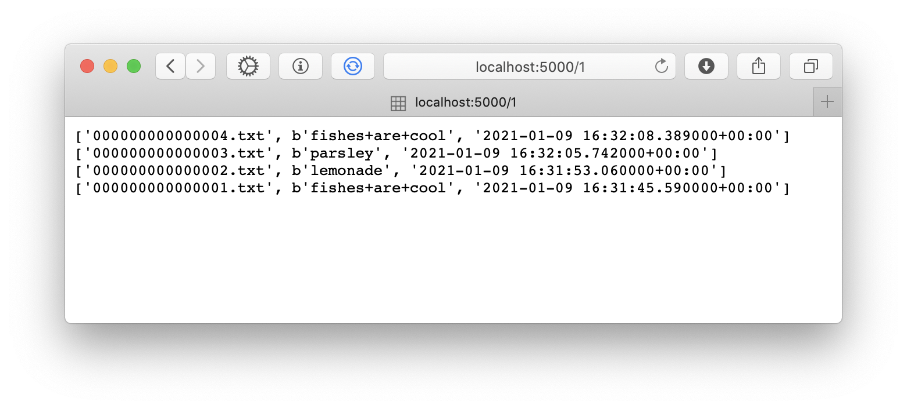

# serverlessGCP

Serverless app demonstration with GCP cloud run and cloud storage.

It exposes a simple web interface where you can view and post messages that are stored on cloud storage.

Honestly, this feels like the perfect way to build and deploy web applications. Simple, low cost, testable, with support for basically any code or library out there.

# User Interface

The local server runs on port 5000 by default and shows the posts that have been submitted to the app:

You can add a post by going to `https:localhost:5000/new_post/<text_want_to_post>`

# Deployment

Use `runLocal.sh` to run the app locally in Docker. Use `runCloud.sh` to run the app on GCP.
